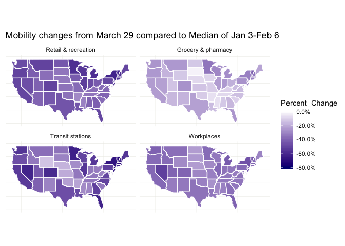
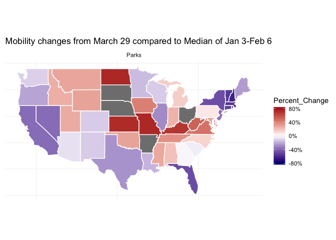

# covid19_google_mobility_map
Percent change from Jan-Feb median in mobility 

# Data
Data were scraped from [google.com/covid19/mobility/](https://www.google.com/covid19/mobility/), roughtly extracted from the PDFs of each state.
See `.Rmd` file for code that generated the maps.

# Maps
Plotting percentage change for each state. Separating the categories that only show reduction to show finer resolution of change in color-bar.

## General reduction in density: Retail/Grocery/Transit/Workplaces

## Mixed change in density: Parks/Residential

* People are staying home more
* Huge surges in people going to parks in certain states. 

