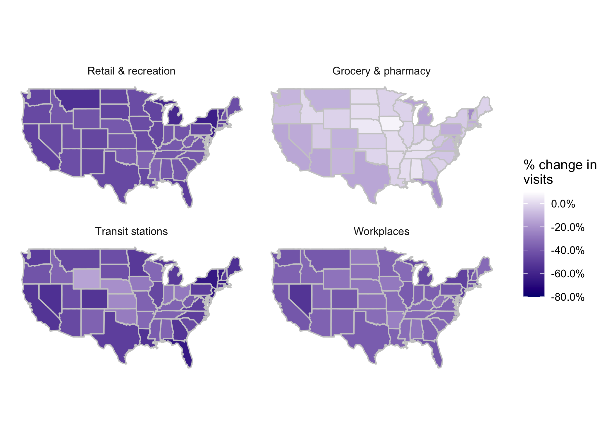
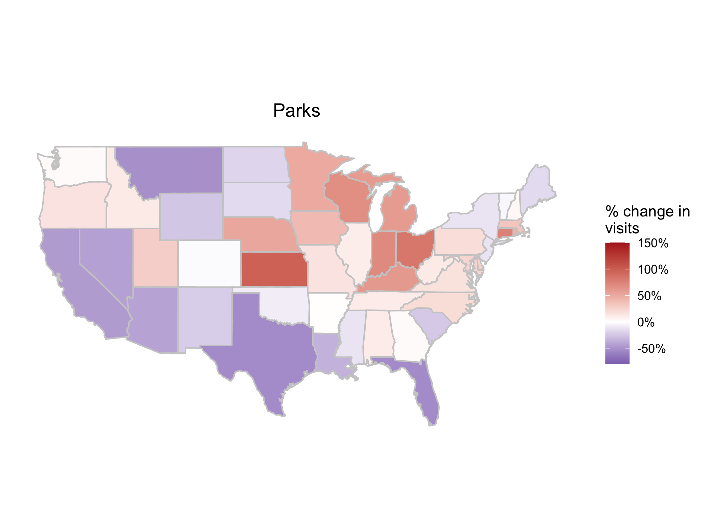

# COVID-19 Community Mobility Map (data from Google)

# Data
* Data were scraped from [google.com/covid19/mobility/](https://www.google.com/covid19/mobility/), roughtly extracted from the PDFs of each state. These are percent change in visits from **April 11** compared to the median value from Jan 3 - Feb 6.
* See `.Rmd` file for code that generated the maps.
* [Website](https://mychan24.github.io/covid19_google_mobility_map/) with maps that has hover-over data (state name and percentage)

# Maps
* Plotting percentage change in visits to different category of places for each state. 
* Separating the categories that only show reduction, increases, and a mixed to show finer resolution of change in color-bar.

## General reduction in density: Retail/Grocery/Transit/Workplaces

## General increase in density: Residential

* People are staying home more

## Mixed change in density: Parks

* Huge surges in people going to parks in certain states.

